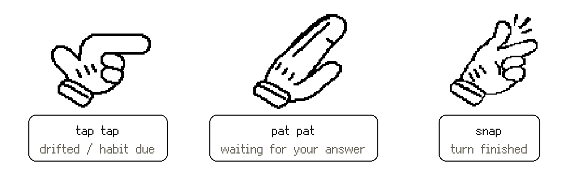

**English** | [中文](README.zh-CN.md)

# shoulder-tap 👀

Tell the model what you're doing today. From then on, whenever you drift to something else, it taps you on the shoulder before it starts.

Not a todo app. A todo app needs you to open it, and when you're drifting you won't. This one hooks into the Claude Code / Codex you're already using.

> **Your habits and your tasks never leave your machine.**
> shoulder-tap has no server. Data lives in one JSON file on this machine, or in your own Notion (this machine talks to it directly).

## 1. Install

Needs Node 20+. The hand on your screen is optional: Windows needs the .NET 10 SDK, macOS needs the Xcode command line tools (`xcode-select --install`). Without them, the tap lands in the chat instead.

```bash
git clone https://github.com/FranklinXuNorth/shoulder-tap.git
cd shoulder-tap
node install.mjs
```

## 2. Settings page

The installer opens a settings page in your browser (reachable only from this machine). Five steps, each skippable:

1. **Connect your coding tool** — click "Connect" to hook shoulder-tap into Claude Code / Codex. Claude Desktop can be connected here too, tools only (see below).
   Don't want to click? Expand "do it yourself" for a block you can paste straight to your coding agent.
2. **First habit** — any name you like. A **soft habit** is simple and quick (drink water), so it can't be skipped: it keeps reminding until you say you did it. A **hard habit** depends on how the day goes (workout), so you can say "not today".
3. **Today's tasks** — one per line, in order.
4. **Where data lives** — this machine (default, nothing to configure), or your own Notion (visible on your phone too).
5. **The hand** — play the three gestures, pick a style (glove or cat paw), try a real tap on your desktop.

Come back any time: click the Windows tray / macOS menu bar icon, or:

```bash
node ~/.claude/skills/shoulder-tap/onboard.mjs
```

The setup ends with a short "try it" step: messages you can paste into Claude Code to see it work.

After setup, clicking the tray / menu bar icon opens a home screen with two buttons, **Run setup again** and **Choose a skin** (preview the three gestures, try a real tap). Below them are your records: tasks from the last two weeks by day (check off or skip today's), your habits (log or skip one), and habit history.
There is a 中文 / English switch in the top right.

Restart your Claude Code session and it's connected. `/mcp` shows `shoulder-tap`, `/hooks` shows four hooks.

## 3. Use it

In Claude Code, say:

- "Today I'm doing A, B, C" — sets the list
- "Remind me to drink water every 60 minutes" — adds a habit
- "Drank water" / "No workout today" — logs it / skips it
- "How many times did I drink water this week" — history

Then just work. When you drift, the reply ends with a hand and the desktop taps you.

## Manual install (no script)

If you'd rather not let a script touch `~/.claude`, do each step yourself:

1. **Skill**: copy `skill/shoulder-tap/` to `~/.claude/skills/shoulder-tap/`.

   ```bash
   mkdir -p ~/.claude/skills && cp -r skill/shoulder-tap ~/.claude/skills/
   ```

2. **MCP**:

   ```bash
   claude mcp add -s user shoulder-tap -- node ~/.claude/skills/shoulder-tap/mcp.mjs
   ```

   For Codex, add to `~/.codex/config.toml`:

   ```toml
   [mcp_servers.shoulder-tap]
   command = "node"
   args = ["/Users/you/.claude/skills/shoulder-tap/mcp.mjs"]
   ```

   For Claude Desktop (the chat app), add to `claude_desktop_config.json` (Settings → Developer → Edit Config), then fully quit and reopen it:

   ```json
   "mcpServers": {
     "shoulder-tap": { "command": "node", "args": ["/Users/you/.claude/skills/shoulder-tap/mcp.mjs"] }
   }
   ```

   Claude Desktop has no hooks and doesn't read CLAUDE.md, so it only gets the tools: it won't stop you or tap on its own, it runs them when you ask ("what's on my list", "just drank water").

3. **Hooks**: add to `~/.claude/settings.json` (create it if missing):

   ```json
   {
     "hooks": {
       "UserPromptSubmit": [{ "hooks": [{ "type": "command", "command": "node \"$HOME/.claude/skills/shoulder-tap/watch.mjs\"", "timeout": 10 }] }],
       "PostToolUse":      [{ "matcher": "*", "hooks": [{ "type": "command", "command": "node \"$HOME/.claude/skills/shoulder-tap/watch.mjs\"", "timeout": 10 }] }],
       "Stop":             [{ "hooks": [{ "type": "command", "command": "node \"$HOME/.claude/skills/shoulder-tap/watch.mjs\"", "timeout": 10 }] }],
       "PreToolUse":       [{ "matcher": "AskUserQuestion", "hooks": [{ "type": "command", "command": "node \"$HOME/.claude/skills/shoulder-tap/watch.mjs\"", "timeout": 10 }] }]
     }
   }
   ```

4. **CLAUDE.md**:

   ```bash
   cat skill/CLAUDE.md.snippet >> ~/.claude/CLAUDE.md
   ```

5. **Desktop** (optional):

   ```bash
   # Windows
   dotnet publish desktop -c Release -o "$HOME/.claude/shoulder-tap/app"
   # macOS
   APP=~/.claude/shoulder-tap/app/ShoulderTap.app
   mkdir -p $APP/Contents/{MacOS,Resources}
   xcrun -sdk macosx swiftc -O desktop-mac/ShoulderTap.swift -o $APP/Contents/MacOS/shoulder-tap-tap
   cp skill/shoulder-tap/ui/sprites/skins/glove/{tap,pat,snap}.png $APP/Contents/Resources/
   cp desktop-mac/Info.plist $APP/Contents/
   ```

   Run the executable once and it stays in the tray / menu bar.

6. **Settings page**: `node ~/.claude/skills/shoulder-tap/onboard.mjs --setup`.

## Desktop

The hand at the right edge of your screen: **snap** (turn finished), **pat pat** (the model is waiting for your answer), **tap tap** (you drifted / a habit is due).

- **Windows**: lives in the tray, starts with Windows. To stop autostart:
  `Remove-ItemProperty -Path 'HKCU:\Software\Microsoft\Windows\CurrentVersion\Run' -Name shoulder-tap`
- **macOS**: lives in the menu bar, starts at login. To stop:
  `launchctl bootout gui/$(id -u) ~/Library/LaunchAgents/com.shoulder-tap.tap.plist`
- **Linux**: not yet. The contract is in [desktop-linux/README.md](desktop-linux/README.md).

All three platforms read the hand sprites from `~/.claude/skills/shoulder-tap/ui/sprites/skins/<style>/`. To draw your own, see the README there.

## Uninstall

```bash
node ~/.claude/skills/shoulder-tap/uninstall.mjs          # keeps your data
node ~/.claude/skills/shoulder-tap/uninstall.mjs --purge  # removes data and keys too
```

Same on all three platforms: quits the desktop app and removes autostart, the MCP (Claude Code, Codex and Claude Desktop), the hooks, the CLAUDE.md section and the skill. Your Notion database is untouched.
You can also just tell Claude Code "uninstall shoulder-tap"; it knows to run this.

## What leaves this machine

| What | Where | When |
| --- | --- | --- |
| Tasks, habits | Your own Notion | Only if you chose Notion |
| Everything else | Nowhere | — |

## More

- What each part is, what the data looks like: [docs/architecture.html](docs/architecture.html)
- How one tap works, the three-way judgment, habit rules: [docs/flow.html](docs/flow.html)
- Cross-device (one machine finishes, the tap lands on the one you're looking at): the [`cross-machine`](../../tree/cross-machine) branch, still in testing, not in this version
