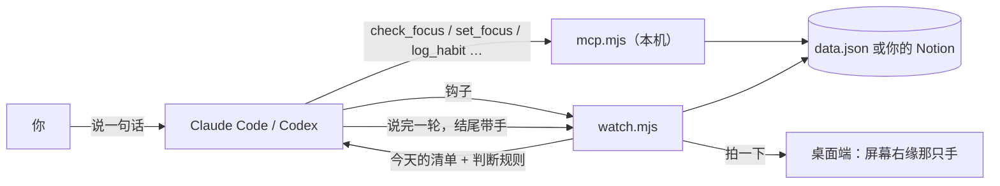

# shoulder-tap 👀

你告诉模型今天要做什么。之后你每想干点别的，它在动手之前先拍你一下肩膀。

不是 todo app——todo app 要你主动打开，而你跑偏的时候恰恰不会打开它。
这个挂在你已经在用的 Claude Code / Codex 上。

> **你的所有习惯 + 要做的事情的数据不上云。**
> shoulder-tap 没有服务器：数据要么在这台机器的一个 JSON 文件里，要么在你自己的 Notion 里（这台机器直接连）。

## 装

需要 Node 20+。桌面端（屏幕上那只手）Windows 版要 .NET 10 SDK，macOS 版要 Xcode 命令行工具
（`xcode-select --install`）；没有它们一切照常，拍肩落在聊天里而不是屏幕上。

```bash
git clone https://github.com/FranklinXuNorth/shoulder-tap.git
cd shoulder-tap
node install.mjs
```

装完浏览器里会打开设置页（只监听 127.0.0.1），四步，每步都能跳过：

1. **接上编程工具** —— 一键把本机 MCP 接进 Claude Code / Codex。
2. **第一个习惯** —— 名字你自己定。**软习惯**是简单、随手就能做的（喝水这种），正因为简单所以不能跳过，
   到点就提醒到你做了为止；**硬习惯**受当天情况影响大（健身这种），可以说「今天不做」。
3. **今天要做的事** —— 一行一件，按先后顺序。
4. **数据放哪** —— 就放这台机器（默认，什么都不用配），或者你自己的 Notion（手机上也能看）。

之后随时回来改：Windows 托盘 / macOS 菜单栏里点「设置…」，或者 `node ~/.claude/skills/shoulder-tap/onboard.mjs`。

## 一次拍肩怎么走



每一块是什么看 [docs/architecture.html](docs/architecture.html)，完整的流程（第一次设置、每一轮对话、
三档判断、习惯）看 [docs/flow.html](docs/flow.html)。

## 装了些什么

`install.mjs` 可以重复跑，已有的 `.env` 不会被覆盖。它动的都在 `~/.claude` 下：

| 位置 | 放了什么 | 作用 |
| --- | --- | --- |
| `skills/shoulder-tap/` | `mcp.mjs`、`watch.mjs`、`onboard.mjs`、`core/` | 本机 MCP、钩子、设置页。没有 npm 依赖 |
| `settings.json` → `hooks` | `UserPromptSubmit`、`PostToolUse`、`Stop`、`PreToolUse`（只匹配 `AskUserQuestion`），都跑 `watch.mjs` | 你每次开口、每次工具调用后、模型每说完一轮、模型要问你话时，替模型看一眼清单、拍一下桌面 |
| `CLAUDE.md` → 「## 专注」 | [skill/CLAUDE.md.snippet](skill/CLAUDE.md.snippet) | 告诉模型怎么用 `check_focus`、跑偏时怎么提醒、每轮结尾打哪只手。已有这一节就不动 |
| `shoulder-tap/app/` | 桌面端 | 见下 |
| `shoulder-tap/data.json` · `config.json` | 本地数据、选了哪种存储 | 设置页写，MCP 读写 |

在 Claude Code 里 `/mcp` 能看到 `shoulder-tap`、`/hooks` 能看到那四个钩子，就是接上了。

### 不跑 install.mjs，手动装

不想让脚本动 `~/.claude`，或者不用 coding agent 装，上面那张表的每一行都能自己敲。全程只要 Node 和 `claude` 命令行。

1. **skill**：把仓库里的 `skill/shoulder-tap/` 整个拷到 `~/.claude/skills/shoulder-tap/`（`*.test.mjs` 不用拷）。

   ```bash
   mkdir -p ~/.claude/skills && cp -r skill/shoulder-tap ~/.claude/skills/
   # Windows PowerShell：Copy-Item -Recurse skill\shoulder-tap "$HOME\.claude\skills\"
   ```

2. **MCP**：Claude Code 一条命令；Codex 改 `~/.codex/config.toml`。

   ```bash
   claude mcp add -s user shoulder-tap -- node ~/.claude/skills/shoulder-tap/mcp.mjs
   claude mcp get shoulder-tap   # 显示 stdio、Connected 就对了
   ```

   ```toml
   [mcp_servers.shoulder-tap]
   command = "node"
   args = ["/Users/你/.claude/skills/shoulder-tap/mcp.mjs"]
   ```

3. **钩子**：在 `~/.claude/settings.json` 的 `hooks` 里加这四段（文件不存在就新建，`{ "hooks": { … } }`）。

   ```json
   {
     "hooks": {
       "UserPromptSubmit": [{ "hooks": [{ "type": "command", "command": "node \"$HOME/.claude/skills/shoulder-tap/watch.mjs\"", "timeout": 10 }] }],
       "PostToolUse":      [{ "matcher": "*", "hooks": [{ "type": "command", "command": "node \"$HOME/.claude/skills/shoulder-tap/watch.mjs\"", "timeout": 10 }] }],
       "Stop":             [{ "hooks": [{ "type": "command", "command": "node \"$HOME/.claude/skills/shoulder-tap/watch.mjs\"", "timeout": 10 }] }],
       "PreToolUse":       [{ "matcher": "AskUserQuestion", "hooks": [{ "type": "command", "command": "node \"$HOME/.claude/skills/shoulder-tap/watch.mjs\"", "timeout": 10 }] }]
     }
   }
   ```

4. **CLAUDE.md**：把 [skill/CLAUDE.md.snippet](skill/CLAUDE.md.snippet) 的内容贴到 `~/.claude/CLAUDE.md` 末尾。

   ```bash
   cat skill/CLAUDE.md.snippet >> ~/.claude/CLAUDE.md
   ```

5. **桌面端**（可选，没有就只在聊天里拍）：

   ```bash
   # Windows（要 .NET 10 SDK）
   dotnet publish desktop -c Release -o "$HOME/.claude/shoulder-tap/app"
   # 开机自启（可选）
   Set-ItemProperty -Path 'HKCU:\Software\Microsoft\Windows\CurrentVersion\Run' -Name shoulder-tap -Value "`"$HOME\.claude\shoulder-tap\app\shoulder-tap-tap.exe`""

   # macOS（要 Xcode 命令行工具）：目录结构和 Info.plist 照 install.mjs 里的写
   mkdir -p ~/.claude/shoulder-tap/app/ShoulderTap.app/Contents/{MacOS,Resources}
   swiftc -O desktop-mac/ShoulderTap.swift -o ~/.claude/shoulder-tap/app/ShoulderTap.app/Contents/MacOS/shoulder-tap-tap
   cp skill/shoulder-tap/ui/sprites/*.png ~/.claude/shoulder-tap/app/ShoulderTap.app/Contents/Resources/
   ```

   然后双击 / 直接跑那个可执行文件，它常驻在托盘或菜单栏。

6. **设置页**：习惯、今天的事、数据放哪，都在这里点。

   ```bash
   node ~/.claude/skills/shoulder-tap/onboard.mjs
   ```

重开一次 Claude Code 会话，工具和钩子就生效了。

## 桌面端

屏幕右缘那只手。三种手势：**响指**（这轮做完了）、**拍拍**（模型弹了个问题在等你）、**taptap**（跑偏了 / 习惯到点了）。
聊天里的 ASCII 手不变：结尾那只拍拍是「这轮到此为止」的记号，桌面看见它就打响指。

- **Windows**：只有托盘图标的常驻进程，开机自启（HKCU 的 Run 键，不需要管理员）。左键看今天的清单，右键试拍、设置、退出。
  不想自启：`Remove-ItemProperty -Path 'HKCU:\Software\Microsoft\Windows\CurrentVersion\Run' -Name shoulder-tap`。
- **macOS**：包成 `ShoulderTap.app`，只有菜单栏图标，LaunchAgent 登录自启。本机编译，不需要签名，也不会被 Gatekeeper 拦。
  取消自启：`launchctl bootout gui/$(id -u) ~/Library/LaunchAgents/com.shoulder-tap.tap.plist`。
  **这一版是在没有 Mac 的机器上写的，还没在真机上编过**——`node install.mjs` 报错就把错误贴回来。
- **Linux**：还没有，接口约定在 [desktop-linux/README.md](desktop-linux/README.md)。

第一次启动时如果还没设置过，它会自己打开设置页。细节见 [desktop/README.md](desktop/README.md)。

## 工具

| 工具 | 做什么 |
| --- | --- |
| `check_focus(activity?)` | 拦路的那个。返回今天的清单、当前那条、该怎么处理你现在想做的事，顺带报到点的习惯 |
| `set_focus` / `add_focus` / `complete_focus` | 按顺序记、插队、勾掉。只有你说完成才算完成 |
| `add_habit(name, kind, …)` | 盯一个习惯：隔多久一次，或每天几点。`kind` = `soft`（简单随手，不能跳过）/ `hard`（看情况，可以说今天不做） |
| `log_habit(habit, skip?)` | 记一笔刚做了；`skip` = 今天不做，软习惯会被拒绝 |
| `stop_habit(habit)` | 以后不用再盯了。历史留着，只是不再提醒 |
| `habit_history(habit?)` | 每一次做了 / 跳过的记录，新的在前 |
| `setup(notion_page)` | 用 Notion 存储时建库 / 接管已有的库 |

时区从你机器上读，不写死：你换了地方它自己就变。语义判断是调用方的模型做的。

## 用 Notion 存的时候长什么样

一个库 `Shoulder Tap`，靠 `Kind` 区分两种行：

| 字段 | 类型 | `task` 行 | `habit` 行 |
| --- | --- | --- | --- |
| `Name` | title | 步骤本身 | 习惯名 |
| `Kind` | select | `task` | `habit` |
| `ID` | rich_text | `t-a3f91c` | `h-8b12d4` |
| `Order` | number | 第几条，顺序靠它 | — |
| `Status` | select | pending / done / dropped | pending = 当前激活；done = 做了；dropped = 跳过或停用 |
| `Day` | date | 哪一天（存 UTC，读时按你的时区换算） | 这一次被激活的时刻（UTC） |
| `TZ` | rich_text | 写这行时你在哪个时区 | 同左，`At` 按它算 |
| `EveryMinutes` | number | — | 隔多久提醒一次（和 `At` 二选一） |
| `At` | rich_text | — | 每天几点提醒，`HH:MM` |
| `Last` | date | — | 这一次做完（或跳过）的时刻 |
| `Type` | select | — | `soft`（简单随手，不能跳过）/ `hard`（看情况，可以说今天不做） |
| `Note` | rich_text | 执行细节 | 备注，跳过的原因也写这 |

习惯**一次一行**：做了，这一行变 `done`，同时生成下一行 `pending`；跳过，这一行变 `dropped`，下一行从明天算起；
停用，这一行变 `dropped`、不再生成下一行。所以历史就是「Kind = habit 且 Status ≠ pending」，在 Notion 里建个视图就能看。
改名字、间隔、软硬，改 `pending` 那一行，后面的照抄它。本地存储（`data.json`）是同一个模型。

建完就是普通的 Notion 数据库，加视图、改间隔、手机上勾，都随你。已有的库会被接管，只补缺的字段；
老库里没有 `Status` 的习惯行当作激活中，下次记一笔时自动转成新格式。

## 本机直连 Jev（可选）

`watch.mjs` 在你开口时可以直接从你机器上请求 Jev 做首轮「相不相关」的比较。
在 `~/.claude/skills/shoulder-tap/.env` 里填 `JEV_API_KEY`（`JEV_BASE_URL` 默认 `https://api.typesafe.ai`）就开了；
不填就由对话模型自己判。请求 2 秒超时，超了或出错都静默退回模型判断。`SHOULDER_TAP_LOCAL_JEV=0` 可以临时关掉。
这条路只发两行文字（你现在要做的、当前那条），不碰你的其它数据。

## 测试

```bash
node skill/shoulder-tap/core/tools.test.mjs      # 本地存储走一遍全部工具（临时目录，不碰你的数据）
node skill/shoulder-tap/core/protocol.test.mjs   # 习惯到点的算术
node skill/shoulder-tap/completion.test.mjs      # 结尾那只手的识别
dotnet build desktop-tests -c Release && desktop-tests/bin/Release/net10.0-windows/ShoulderTap.Tests.exe <shoulder-tap-tap.exe 路径>
```

## 跨设备

一台机器的 agent 跑完了、手拍到你正盯着的另一台上 —— 这部分在 [`cross-machine`](../../tree/cross-machine) 分支，
还在自己测，demo v1 不带。
