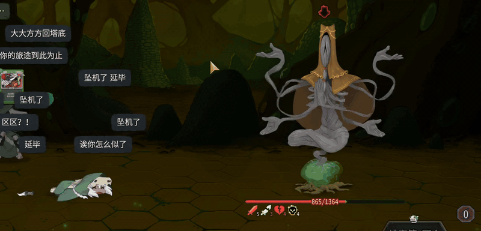
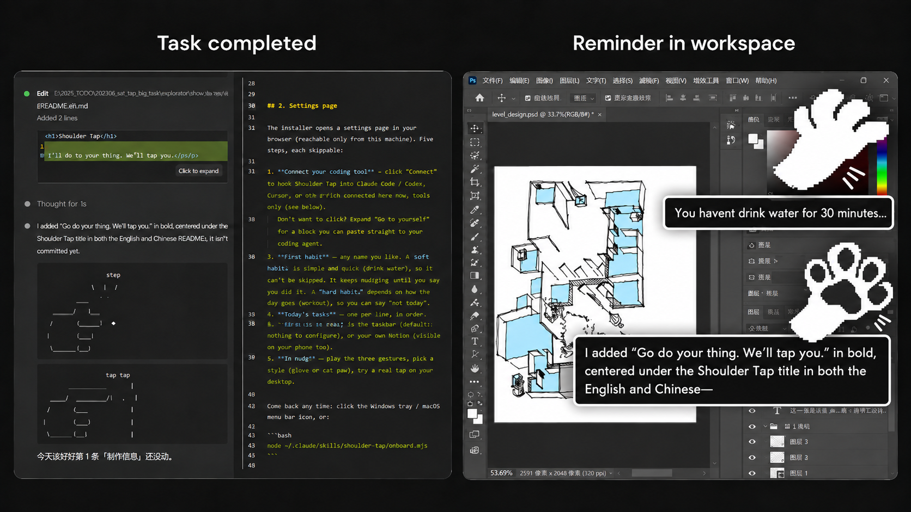

<div align="center">


<h1>Shoulder Tap</h1>

<p><b>Go do your thing. We’ll tap you.</b></p>

<a href="README.md"></a> <a href="README.zh-CN.md"></a>

</div>

<br>

## What is this

Tell the model what you're doing today. From then on, whenever you drift to something else, it taps you on the shoulder before it starts.

When it finishes a turn, a hand taps the edge of your screen and says what it just did, so you can wander off while it works.

<p align="center"></p>

<p align="center"></p>

Not a todo app. A todo app needs you to open it, and when you're drifting you won't. This one hooks into the Claude Code / Codex you're already using.

> **Your habits and your tasks never leave your machine.**
> shoulder-tap has no server. Data lives in one JSON file on this machine, or in your own Notion (this machine talks to it directly).

<br>

## 1. Install

> [!TIP]
> **Recommended: let your coding agent install it.** Paste this into Claude Code or Codex:
>
> ```
> Install https://github.com/FranklinXuNorth/shoulder-tap for me. Follow its README, and when the script is done, open the settings page and tell me what the five steps are (the Notion step is optional; skipping it keeps data on this machine).
> ```
>
> It checks Node / .NET / Xcode tools, runs the script and fixes what fails. Prefer doing it by hand? Read on.

Needs Node 20+. The hand on your screen is optional: Windows needs the .NET 10 SDK, macOS needs the Xcode command line tools (`xcode-select --install`). Without them, the tap lands in the chat instead.

```bash
git clone https://github.com/FranklinXuNorth/shoulder-tap.git
cd shoulder-tap
node install.mjs
```

**The script is only half of it.** It installs the skill, the hooks, the CLAUDE.md section and the desktop app — it does *not* connect the MCP and does not know your habits. The rest is clicked on a local settings page:

```
http://127.0.0.1:47823/#setup
```

How that page comes up differs per platform:

| | Settings page | If it doesn't open |
| --- | --- | --- |
| **Windows** | the tray icon starts and opens it | click the tray icon, or open the address above |
| **macOS** | the menu bar icon starts and opens it | click the menu bar icon, or open the address above |
| **Linux** | no desktop app yet, so `install.mjs` opens it itself | `node ~/.claude/skills/shoulder-tap/onboard.mjs --setup` |

> **If a model is installing this for someone:** paste that address into the chat and say what the five steps are, and that the Notion step can be skipped (data then stays on this machine). Finishing the script without a word leaves the person with a half-installed thing they think is done. Let them click the steps themselves — don't fill in their habits or their tasks.

<br>

## 2. Settings page

The installer opens a settings page in your browser (reachable only from this machine), at `http://127.0.0.1:47823/#setup`. Five steps, each skippable:

1. **Connect your coding tool** — click "Connect" to hook shoulder-tap into Claude Code / Codex. Claude Desktop, OpenClaw and Hermes can be connected here too, tools only (see below).
   Don't want to click? Expand "do it yourself" for a block you can paste straight to your coding agent.
   Says Claude Code **Not found** on macOS when you know it is installed? The settings page comes from the menu bar app, which doesn't see your shell PATH. Expand "do it yourself" and run that command in a terminal.
   Then restart your Claude Code session: `/mcp` shows `shoulder-tap`, `/hooks` shows four hooks.
2. **First habit** — any name you like.
   A **soft habit** (drink water) is quick, so it can't be skipped: it reminds you until you say you did it.
   A **hard habit** (workout) depends on the day, so you can say "not today".
3. **Today's tasks** — one per line, in order.
4. **Where data lives** — this machine (default, nothing to configure), or your own Notion (visible on your phone too). **Notion is optional:** skip this step and everything is stored locally; you can switch to Notion later.
5. **The hand** — play the three gestures, pick a style (glove or cat paw), try a real tap on your desktop.

Come back any time: click the Windows tray / macOS menu bar icon, or:

```bash
node ~/.claude/skills/shoulder-tap/onboard.mjs
```

The setup ends with a short "try it" step: messages you can paste into Claude Code to see it work.

After setup, the same icon opens a home screen: **Run setup again**, **Choose a skin**, and below them your records — the last two weeks of tasks, your habits, and habit history. 中文 / English switch in the top right.

<br>

## 3. Use it

In Claude Code, say:

- "Today I'm doing A, B, C" — sets the list
- "Remind me to drink water every 60 minutes" — adds a habit
- "Drank water" / "No workout today" — logs it / skips it
- "How many times did I drink water this week" — history

Then just work. When you drift, the reply ends with a hand and the desktop taps you.

<br>

## Manual install (no script)

If you'd rather not let a script touch `~/.claude`, do each step yourself.

> [!IMPORTANT]
> **Use the paths for your own OS.** The shell commands below are for macOS / Linux Terminal. On Windows, run them in **Git Bash** (it comes with Git for Windows, which Claude Code on Windows needs anyway), not PowerShell. Config files (TOML / JSON / YAML) need a **full path** to `mcp.mjs`, and that path differs:
>
> | | Full path to `mcp.mjs` |
> | --- | --- |
> | **macOS** | `/Users/you/.claude/skills/shoulder-tap/mcp.mjs` |
> | **Linux** | `/home/you/.claude/skills/shoulder-tap/mcp.mjs` |
> | **Windows** | `C:/Users/you/.claude/skills/shoulder-tap/mcp.mjs` (forward slashes; backslashes must be doubled: `C:\\Users\\you\\…`) |
>
> Replace `you` with your user name. The examples below use the macOS path.

1. **Skill**: copy `skill/shoulder-tap/` to `~/.claude/skills/shoulder-tap/`.

   ```bash
   mkdir -p ~/.claude/skills && cp -r skill/shoulder-tap ~/.claude/skills/
   ```

2. **MCP**:

   ```bash
   claude mcp add -s user shoulder-tap -- node ~/.claude/skills/shoulder-tap/mcp.mjs
   ```

   For Codex, add to `~/.codex/config.toml`:

   ```toml
   [mcp_servers.shoulder-tap]
   command = "node"
   args = ["/Users/you/.claude/skills/shoulder-tap/mcp.mjs"]
   ```

   For Claude Desktop (the chat app), add to `claude_desktop_config.json` (Settings → Developer → Edit Config), then fully quit and reopen it:

   ```json
   "mcpServers": {
     "shoulder-tap": { "command": "node", "args": ["/Users/you/.claude/skills/shoulder-tap/mcp.mjs"] }
   }
   ```

   Where that file lives: macOS `~/Library/Application Support/Claude/`, Windows `%APPDATA%\Claude\` (Microsoft Store install: `%LOCALAPPDATA%\Packages\Claude_*\LocalCache\Roaming\Claude\`).

   OpenClaw:

   ```bash
   openclaw mcp add shoulder-tap --command node --arg /Users/you/.claude/skills/shoulder-tap/mcp.mjs
   ```

   Hermes Agent: add under `mcp_servers` in `~/.hermes/config.yaml`, then restart Hermes or type `/reload-mcp`:

   ```yaml
   mcp_servers:
     shoulder-tap:
       command: "node"
       args: ["/Users/you/.claude/skills/shoulder-tap/mcp.mjs"]
   ```

   Claude Desktop, OpenClaw and Hermes have no hooks and don't read CLAUDE.md, so they only get the tools: they won't stop you or tap on their own, they run them when you ask ("what's on my list", "just drank water").

3. **Hooks**: add to `~/.claude/settings.json` (create it if missing):

   ```json
   {
     "hooks": {
       "UserPromptSubmit": [{ "hooks": [{ "type": "command", "command": "node \"$HOME/.claude/skills/shoulder-tap/watch.mjs\"", "timeout": 10 }] }],
       "PostToolUse":      [{ "matcher": "*", "hooks": [{ "type": "command", "command": "node \"$HOME/.claude/skills/shoulder-tap/watch.mjs\"", "timeout": 10 }] }],
       "Stop":             [{ "hooks": [{ "type": "command", "command": "node \"$HOME/.claude/skills/shoulder-tap/watch.mjs\"", "timeout": 10 }] }],
       "PreToolUse":       [{ "matcher": "AskUserQuestion", "hooks": [{ "type": "command", "command": "node \"$HOME/.claude/skills/shoulder-tap/watch.mjs\"", "timeout": 10 }] }]
     }
   }
   ```

4. **CLAUDE.md**:

   ```bash
   cat skill/CLAUDE.md.snippet >> ~/.claude/CLAUDE.md
   ```

5. **Desktop** (optional):

   **Windows** (needs the .NET 10 SDK):

   ```bash
   dotnet publish desktop -c Release -o "$HOME/.claude/shoulder-tap/app"
   ```

   **macOS** (needs the Xcode command line tools):

   ```bash
   APP=~/.claude/shoulder-tap/app/ShoulderTap.app
   mkdir -p $APP/Contents/{MacOS,Resources}
   xcrun -sdk macosx swiftc -O desktop-mac/ShoulderTap.swift -o $APP/Contents/MacOS/shoulder-tap-tap
   cp skill/shoulder-tap/ui/sprites/skins/glove/{tap,pat,snap}.png $APP/Contents/Resources/
   cp desktop-mac/Info.plist $APP/Contents/
   ```

   Run the executable once and it stays in the tray / menu bar.

6. **Settings page** — the step that is easiest to forget, and nothing works without it: `node ~/.claude/skills/shoulder-tap/onboard.mjs --setup`, or open `http://127.0.0.1:47823/#setup`. Same on all three platforms.

<br>

## Desktop

The hand at the right edge of your screen: **snap** (turn finished), **pat pat** (the model is waiting for your answer), **tap tap** (you drifted / a habit is due).

- **Windows**: lives in the tray, starts with Windows. To stop autostart:
  `Remove-ItemProperty -Path 'HKCU:\Software\Microsoft\Windows\CurrentVersion\Run' -Name shoulder-tap`
- **macOS**: lives in the menu bar, starts at login. To stop:
  `launchctl bootout gui/$(id -u) ~/Library/LaunchAgents/com.shoulder-tap.tap.plist`
  Hand shows up but never moves? macOS **Reduce motion** (System Settings → Accessibility → Display) is on, and it is respected: the hand holds its most extended frame instead of animating. To animate anyway, put `"motion": "always"` in `~/.claude/shoulder-tap/config.json`.
- **Linux**: not yet. The contract is in [desktop-linux/README.md](desktop-linux/README.md).

All three platforms read the hand sprites from `~/.claude/skills/shoulder-tap/ui/sprites/skins/<style>/`. To draw your own, see the README there.

<br>

## Uninstall

```bash
node ~/.claude/skills/shoulder-tap/uninstall.mjs          # keeps your data
node ~/.claude/skills/shoulder-tap/uninstall.mjs --purge  # removes data and keys too
```

Same on all three platforms: quits the desktop app and removes autostart, the MCP (Claude Code, Codex, Claude Desktop, OpenClaw, Hermes), the hooks, the CLAUDE.md section and the skill. Your Notion database is untouched.
You can also just tell Claude Code "uninstall shoulder-tap"; it knows to run this.

<br>

## What leaves this machine

| What | Where | When |
| --- | --- | --- |
| Tasks, habits | Your own Notion | Only if you chose Notion |
| Everything else | Nowhere | — |

<br>

## More

- What each part is, what the data looks like: [docs/architecture.html](docs/architecture.html)
- How one tap works, the three-way judgment, habit rules: [docs/flow.html](docs/flow.html)
- Cross-device (one machine finishes, the tap lands on the one you're looking at): the [`cross-machine`](../../tree/cross-machine) branch, still in testing, not in this version

<br>

## License

Code is MIT. The hand and cat-paw artwork (images and Aseprite files in `skill/shoulder-tap/ui/sprites/`, plus `docs/hands-banner.gif`) is CC BY-NC-ND 4.0: share it unchanged for non-commercial use, no selling, no modified versions. The name "Shoulder Tap" is not licensed, so a product built from this code needs its own name and its own art. Details in [LICENSE](LICENSE).
